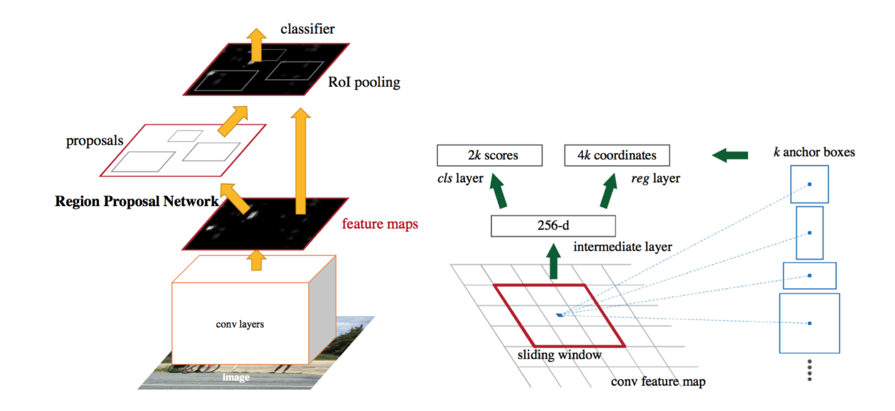

<h1>Object Detection Tutorial - Identifying Defects in Steel Plates</h1>


As step-by-step tutorial detailing how to fine-tune a pre-trained model using custom data to detect steel plate surface defects in images.

[Python 3.10]

## Getting Started

If this is your first time using this application, please ensure that you install the neccesary requirements using the following command:

```sh
bin/install_requirements.sh
```

## Using the Notebook

A tutorial notebook is provided to walk through the process of building an object detection model. Follow the intructions in `steel_defect_detection.ipynb` to get started.

### Summary of Commands

The `bin/` directory contains basic shell bin that allow us access to common commands on most
environments.

- `bin/install_requirements.sh` - pip installs all requirements in `requirements.txt`
- `bin/preprocess.sh` - preprocess the data
- `bin/train.sh` - train a model
- `bin/unit_test.sh` - run unit tests defined in `tests/`
- `bin/visualize.sh` - visualize the model predictions

### Training

To train the model, all you need to do is run this command:

```sh
bin/train.sh
```

### Unit Testing

We can run the project's unit tests to verify everything is
working. The below command will execute all unit tests defined in the `tests/` directory.

```sh
bin/unit_test.sh
```

If you want to run a test on a specific file or directory (rather than running all the tests in
the tests/ directory), you can use the `-k` flag and list the file path afterwards.

For example, if we specifically wanted to run a test called "test_api", and its file path is as
"tests/test_api.py", we can run:

```shell script
bin/test.sh -k test_api.py
```
